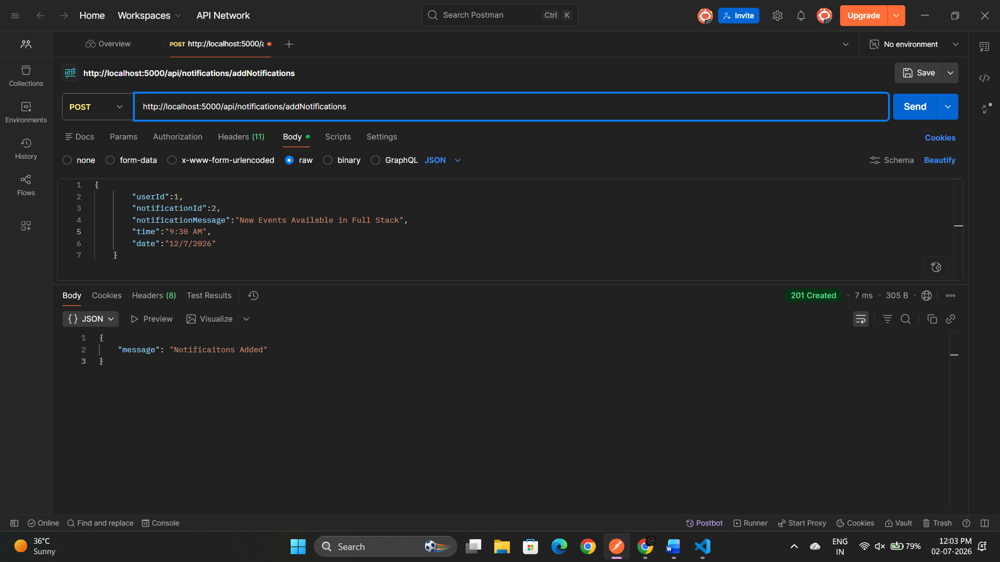
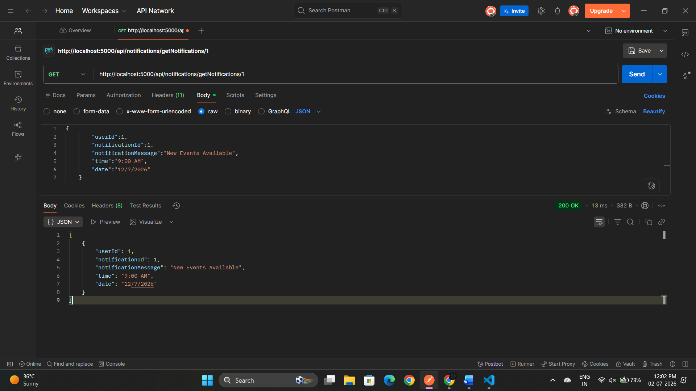

The Notification System Consists of Two main API

AddNotifications:
"/api/notifications/addNotifications"

request:
{
    userId:,
    notificaitonId:,
    notificationMessage:,
    time:,
    date:
}

response:
{
    message: "Notification Added"
}

and

Get Notifications:
"/api/notifications/getNotifications/:id"

id given in params and response is the following format

[
    {
        "userId": 1,
        "notificationId": 1,
        "notificationMessage": "New Events Available",
        "time": "9:00 AM",
        "date": "12/7/2026"
    }
]

